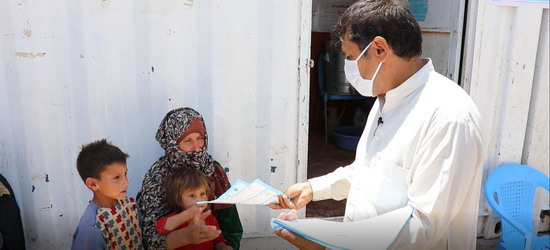
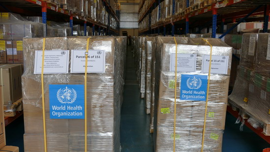

```{r setup, include=FALSE}
knitr::opts_chunk$set(echo = FALSE, warning = FALSE)
library(rmarkdown)
library(readr)
library(tidyverse)
library(lubridate)
library(ggplot2)
library(kableExtra)

```


The virus was confirmed to have spread to Afghanistan when its index case, in Herat, was confirmed on 24 February 2020. Afghan authorities said they suspected three men, who had returned from Iran's Qom city, to be infected with the fatal virus [@Shadi2020]. 

Already 6 months since the first case of COVID-19 was recorded in Afghanistan, the number of cases continues to rise. Ravaged by decades of war, socioeconomic instability and insecurity, the country has long been in a protracted humanitarian crisis. The growing public health emergency due to the pandemic, has made things worse. This has not deterred the resolve and determination of Afghanistan’s health workers who are on the frontlines in the battle against COVID-19 [@WorldHealthOrganization].


On 10 March, the first case was reported outside of Herat province, in Samangan Province, and this later rose to seven in the evening, as the Ministry of Public Health announced one new case in both Herat and Samangan provinces [@Khalid2020]. Therefore, the early spread happened in the first half of March, and the first death case incurred on 22 March [@Tolonews2020], the situation became serious. The table \ref{tab:Afgha_wider} presented the cases of confirmed, death and recovered from March to September as today. 

```{r Afgha_wider}
Afgha <- read_csv("Afghanistan_COVID-19.csv")
Afgha <- Afgha %>%
  select(-'Active Cases', -Tests) %>%
  mutate(Month = month(Date)) 

Afgha_wider <- Afgha %>%
  select(-Province, -Date) %>%
  group_by(Month) %>%
  summarise(Cases=sum(Cases, na.rm = TRUE),
            Deaths=sum(Deaths, na.rm = TRUE),
            Recoveries=sum(Recoveries, na.rm = TRUE))

kable(Afgha_wider, caption = "cases of COVID-19 in Afghanistan per month") %>%
  kable_styling(bootstrap_options = c("striped", "hover"))

```

The table \ref(tab:province_Afgha) below shows the confirmed COVID-19 cases in each Province of Afghanistan. By 5 May 2020, all 34 provinces had at least one confirmed positive case of COVID 19. Until 2 Sep 2020, the Province of Kabul has most confirmed cases as well as deaths and Recoveries, while the Province of Urozgan had the least. 


```{r province_Afgha}
province_Afgha <- Afgha%>%
  select(-Date, -Month) %>%
  group_by(Province) %>%
  summarise(Cases=sum(Cases, na.rm = TRUE),
            Deaths=sum(Deaths, na.rm = TRUE),
            Recoveries=sum(Recoveries, na.rm = TRUE)) %>%
  arrange(-Cases)

kable(province_Afgha, caption = "COVID-19 in Afghanistan by Province as of 2 September 2020") %>%
  kable_styling(bootstrap_options = c("striped", "hover"))
  
  
```

The World Health Organization (WHO) has delivered a shipment of essential COVID-19 medical supplies and equipment to the Central Medical Store of the Ministry of Public Health of Afghanistan. The shipment worth US$ 1.6 million includes 9.5 tons of personal protective equipment (gloves, gowns, surgical masks, face shields, goggles), 10 PCR machines, 100 oxygen concentrator machines, 100 stretchers, 319 RNA extraction kits, micropippets, pippet tip filters, biosafety cabinet and other critical items [@WHO2020].


“COVID-19 is overwhelming the already challenged health care system in Afghanistan. Laboratories and hospitals require these essential items and WHO is working around the clock to provide critical medical supplies and equipment to support the Ministry of Public Health in ensuring that essential health services are maintained and strengthened,” said Dr Rik Peeperkorn, WHO Representative in Afghanistan. "Globally, there is a shortage of COVID-19 essential medical supplies and equipment and WHO, with support from the World Food Programme, is assisting in prioritizing essential items for more than 135 countries in need".  

