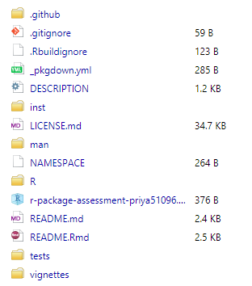
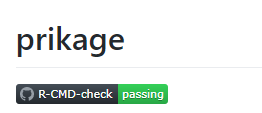
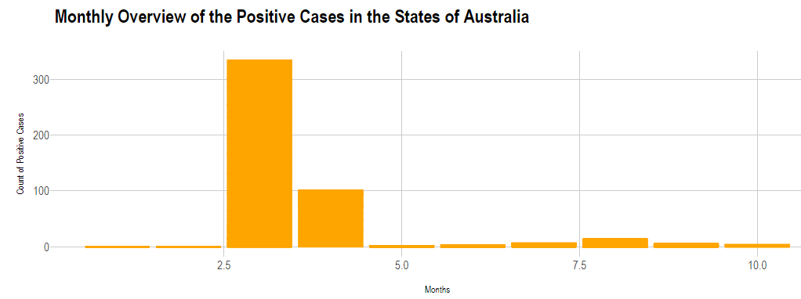
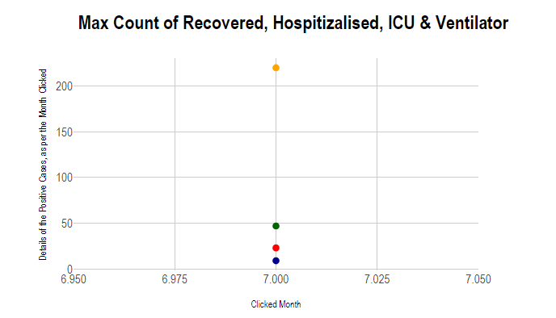

```{r setup, include=FALSE}
knitr::opts_chunk$set(echo = FALSE)
library(knitr)
```

## Package overview
The package of **prikage** created by **Priya Ravindra Dingorkar** gives users an overview of COVID-19, by the exciting graphs embedded in a shiny application and added user interactivity. The Shiny App, is the *heart* of this package. It has a lot of exciting features available for the user in this package, each Tab of the the embedded shiny app is discussed in the vignette with details, including the sicuation of COVID19 Scenario Across the Globe. 

Also, there are several functions contained in the package that are called by the shiny app:

<u>**functions of ui part**</u>:

- *select_input_world_countries()*: allows the user to select any desired country from a list of countries
- *select_input_austate()*: allows the user to select one of the states of Australia 
- *date_slider_input()*: allows the user to select the desired data range

<u>**functions of server part**</u>:

- *gg_covid_line()*: creates line graphs of the covid confirmed, recovered and death cases for covid_data
- *gg_covid_barplot()*: creates a bar chart that shows us the covid- 19 positive case for the user selected state of Australia

<u>**function of launch the app**</u>:

- *launch_app()*

I easily get installed the "**prikage**" through the instructions on the README page from github using *devtools::install_github("etc5523-2020/r-package-assessment-priya51096")*, and I can play around the app with the *launch_app()* function while explore the other functions and knowledge in the package, the structure is complete. 

## Explore the Questions

<p style="border:3px solid #59788E;" <span style="color:#59788E"> 
1. What did I think this package would do? Did it do it?
</span> </p>

The package should contain: 

- *inst/app/* that includes the relevant R code to run shiny app
- functions of *launch_app()* that will load the shiny app
- functions of *interface-side logic* and *server-side logic* of the shiny app that are exported by the package
- tests for the functions created in the package
- the *DESCRIPTION file* includes the introduction of the package, the author field and deppendencies, as well as the *LICENCE file*
- the *vignette* describes the introduction and the guidelines for the shiny app
- the *README.md file* shows the introduction of installand the overview of the package
- the *_pkgdown.yaml file* customises the pkgdown site


Moreover, the package should: 

- pass *R CMD CHECK* without errors or warnings
- pass unit *tests* without errors
- document all functions with *roxygen2* format

When I review the package of "**prikage**", I can see all of the required elements was contained. 

```{r, out.width = "350px"}

```

The *R CMD CHECK* was also passed as we can see in the README.md file, and the other requirements were meet as well. 

```{r, out.width = "250px"}

```

<p style="border:3px solid #59788E;" <span style="color:#59788E"> 
2. Are the improvements that could be made to the code? 
</span> </p>

For the code, I think most of them are really logical and comprehensive, if I have to put forward an improvement, that could be the label of *x-axis* in the **gg_covid_bar_plot**. The **month** was regarded as a continuious variable as shown below, and the label could be look better when using *mutate(month = as.character(month))*.

```{r, out.width = "800px"}

```

<p style="border:3px solid #59788E;" <span style="color:#59788E"> 
3. Are there improvements that could be made to the shiny app inside the package?
</span> </p>

In terms of the shiny app, the contents are plentiful and not boring definitely. There are three webpages to tell the story, and additional one **References** page and one **About** page, which helps the shiny app looks orderly and easily understood for users. However, I think the plotly click graph for the second webpage - "Australia's States" could be changed to other type of figure such as *bar plot* or *lollipop plot*, since it does not make much sense for this *geom_point()* regarding to its x-axis as shown below. The title of the figure can be changed to the specific month as clicking by users, and the *x-axis* could be changed to 4 type of cases: **Recovered, Hospitalized, Ventilator and ICU**, while *y-axis* shows the **number of cases**. 

```{r, out.width = "700px"}

```

<p style="border:3px solid #59788E;" <span style="color:#59788E"> 
4. Is the documentation sufficient to get started?
</span> </p>

As I mentioned before, the package contained most of the required elements and the structure was complete. However, something still need to be improved. All the functions that exported by the package for shiny app are lack of **examples**. The examples of *how to use the function* in the documentation could help users get familiar with your package as soon as possible. 


<p style="border:3px solid #59788E;" <span style="color:#59788E"> 
5. what I’ve learned from reviewing the package?
</span> </p>

After reviewing the package, I learned many ways to make my own shiny app more plentiful, including several different webpages and related navbar to make it orderly. I also learned the way of producing the click plot to make my package more logical. Moreover, the logo created by **Priya Ravindra Dingorkar** in this **prikage** package was really great, and I will remember always leave a feedback place for users same as this package. 

## Appendix 
### Documentation
The package includes all the following forms of documentation:

- [x] **Installation instructions:** for the package is found in README
- [x] **Vignette(s)** demonstrating major functionality that runs successfully locally
- [x] **Function Documentation:** for all exported functions in R help
- [ ] **Examples** for all exported functions in R Help that run successfully locally

#### Comments

- **Installation instructions:** the `README.md` file provides clear instructions on how to install the package from github
- **Vignette(s):** the `Vignette` describes how to launch the app, what the app does, and guidelines for its use
- **Function Documentation:** all exported functions are documented with `roxygen2`  
- **Examples:** there are not sufficient examples to show how to run the functions  

### Functionality

- [x] **Installation:** Installation succeeds as documented.
- [x] **Functionality:** Any functional claims of the software been confirmed.
- [x] **Automated tests:** Unit tests cover essential functions of the package
and a reasonable range of inputs and conditions. All tests pass on the local machine.


